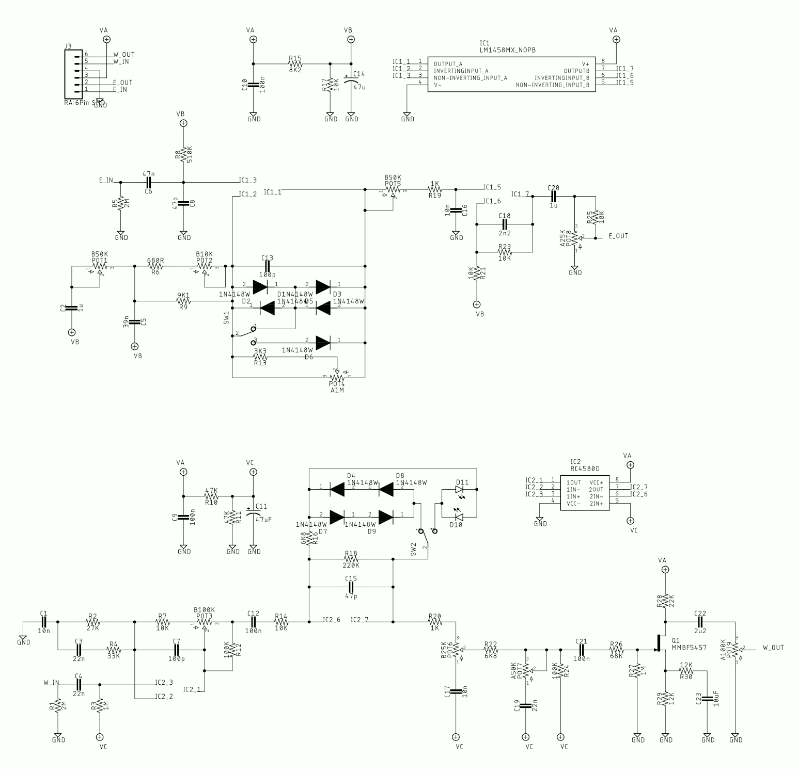
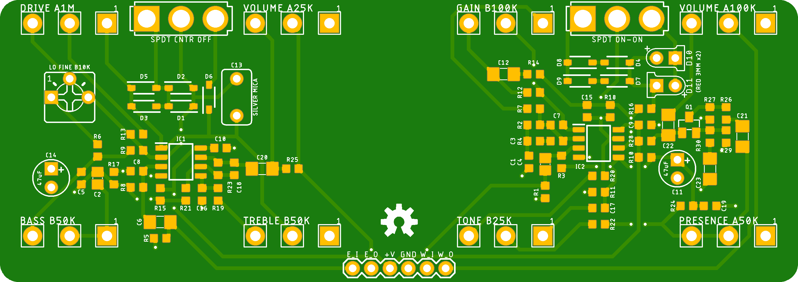
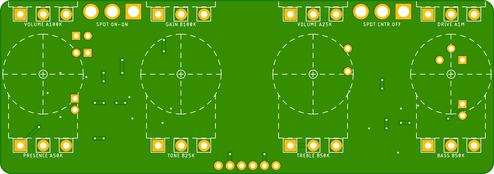

# Superior Overdrive

The [Superior Overdrive](https://clevelandmusicco.com/pedals/superior-overdrive/) is a 2-in-1 powerhouse pedal packed with our EastSide Overdrive stacked into the WestSide Overdrive. This combination of transparent low- and medium-gain drives, with all their tone and clipping options, is a remarkably flexible dirt platform.

There are 3 interdependent PCBs in this pedal's design.

## The Effect PCB

[Tayda Enclosure Drill Template](https://drill.taydakits.com/box-designs/new?public_key=SVhxKzdDNXZjeXVUNXpSM1phNTFkdz09Cg==)

### Through-hole Component Suggestions

Coming soon.

## The I/O PCB

Coming soon.

## The Filtering & Switching PCB

Coming soon.

## Marketing blurb from our official web site

### A space-saving, rugged, and enormously versatile overdrive platform at an affordable price.

The Cleveland Music Co. Superior Overdrive is a 2-in-1 pedal packed with 2 of our most popular overdrives, and they happen to stack extremely well. Use them individually, set them both to detonate, or dial one in as a boost to help you cut through the mix. These two circuits stacked like this is just glorious; better than any other combination we’ve played. That’s why it’s called the Superior Overdrive.

#### EastSide Overdrive (first in the signal chain)
The Cleveland Music Co. EastSide Overdrive is our love letter to the pinnacle of transparent, boutique overdrives: the Timmy. Its low- to medium-gain tones can be dialed in for anything from a powerful, dirty boost for stacking with other pedals, to flat out rock-n-roll grind. With a potent EQ section and plenty of output volume to spare, the EastSide can easily push an on-the-edge amplifier’s tubes into overdrive territory.

* **VOLUME:** Sets the overall output volume. There is quite a lot of output on tap, which makes the EastSide a great boost option for stacking with other overdrives, or slamming the front of your favorite tube amp.
* **GAIN:** Clockwise for more gain; counter-clockwise for less. While there is a little more gain available than typical transparent overdrives, the EastSide is still a medium-gain pedal. Pro tip: putting a boost or another drive in front of the EastSide can push it into high-gain bliss!
* **TREBLE:** Works like you would expect: adds or cuts treble. Clockwise for more; counter-clockwise for less.
* **BASS:** Adds or cuts bass. Clockwise for more; counter-clockwise for less.
* **COMP | SYM | ASYM:** Selects between three clipping options:
 * Compressed aggressively clips the signal, producing a rich, saturated overdrive tone. This is the least transparent setting.
 * Symmetrical clips the peaks and valleys of the signal equally, resulting in a smooth, sustained overdrive tone.
 * Asymmetrical clips the waveform unequally, creating a more open tone.

The EastSide features an internal trimmer that allows you to fine-tune the bass frequencies prior to the distortion stage of the circuit. Great for “hot” humbuckers that tend to overpower typical overdrives.

#### WestSide Overdrive (second in the signal chain)

The Cleveland Music Co. WestSide Overdrive is inspired by the classic Blues Breaker—both the amp and the pedal. After poring over the schematics of the original JTM 45 amplifier, the original pedal, and many pedals based on both, we applied what we feel are the strengths of them all into the WestSide. Not content to be a rehash of the past, the WestSide offers additional tonal and clipping options, increased output volume, and the powerful presence control makes it feel at home in any rig. The result is a touch-sensitive, bluesy, low-gain overdrive that stacks especially well with our other low- to medium-gain drives, and gives you all the presence you need to stand out.

* **VOLUME:** Sets the overall output volume. Unity gain is around 2 o’clock, so the classic “low-gain, high-volume” configuration can really push the front of a tube amp with the volume cranked.
* **GAIN:** Clockwise for more gain; counter-clockwise for less. There is a little more gain available than from typical pedals of this style, so be brave and explore. But for those looking for the so-called traditional sweet spots, try the 9 o’clock to noon range.
* **PRESENCE:** Sets the amount of Presence. Fully counter-clockwise for most rigs (start here!); clockwise to brighten up a dark amp or guitar pickups.
* **TONE:** Clockwise for more treble; counter-clockwise for less.
* **COMP | OPEN:**
 * Compressed is the traditional clipping option for this style pedal, producing a rich, saturated overdrive tone.
 * Open inserts LEDs as the clipping diodes, resulting in a brighter, louder, and more open sound.

True-bypass switching. Jacks and power are on the top to save space on your pedalboard, and the pedal is industry-standard 1590BB size (4.7 in x 3.7 in x 2.5 in, including knobs).