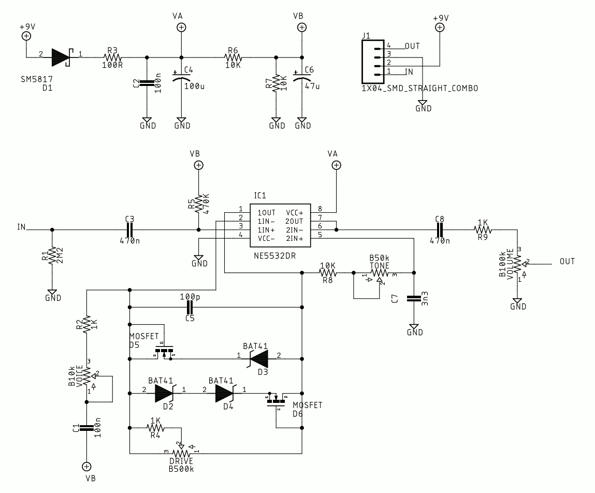
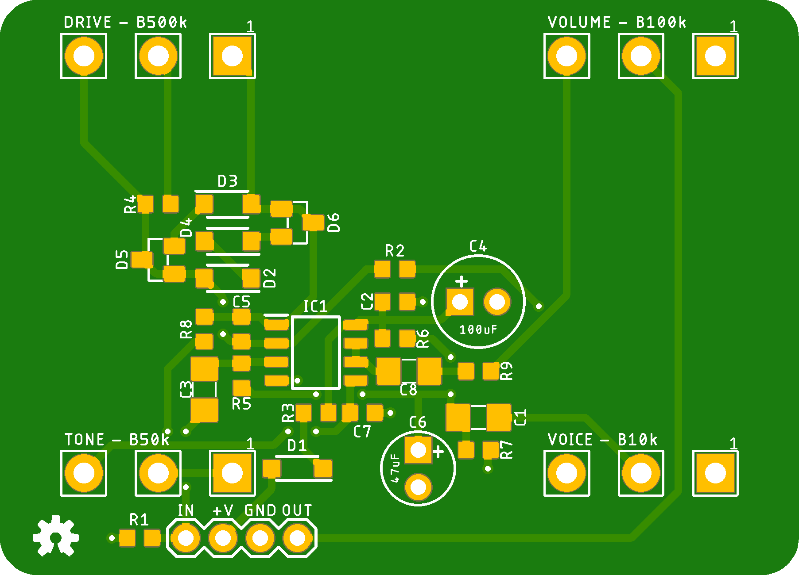
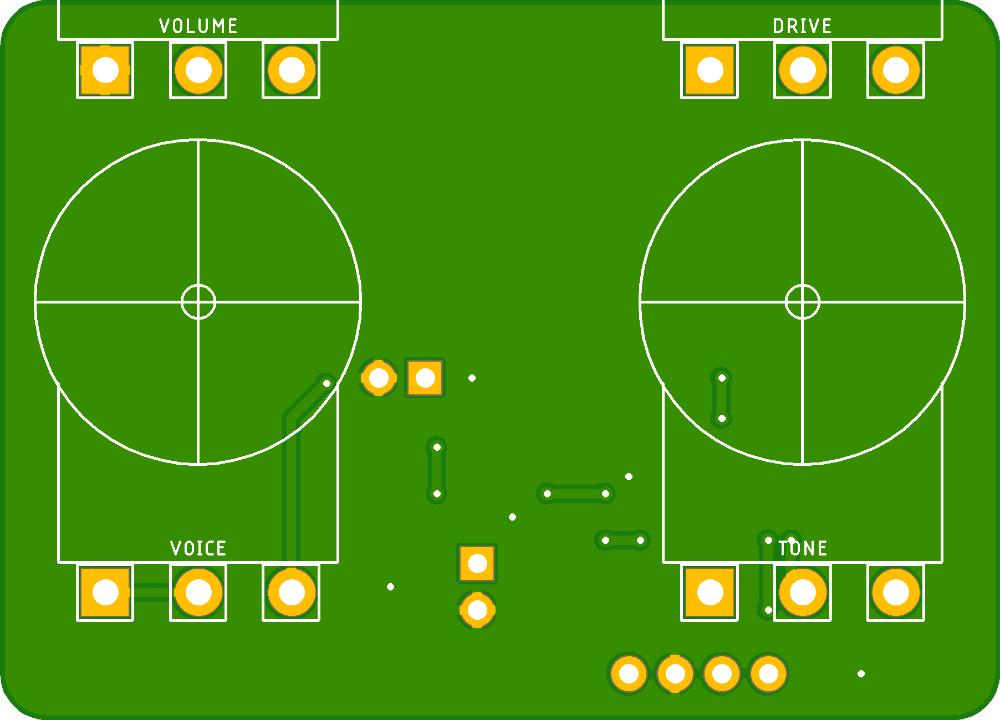

# The Heights Dynadrive

[The Heights Dynadrive](https://clevelandmusicco.com/pedals/heights-dynadrive/) is a great-sounding, medium-gain overdrive circuit that some people are saying emulates the tone of legendary Dumble amplifiers.

OK, that was us. We said that.

[Tayda Enclosure Drill Template](https://drill.taydakits.com/box-designs/new?public_key=Q2JnVDRZVUdWM0dzUno1N0ZWMnJXdz09Cg==)

## Through-hole Component Suggestions

* **C4** - 100uF Low-ESR, 6.3mm diameter, 2.5 mm lead spacing, 0.1" pad spacing @ 25V minimum
* **C6** - 47uF Low-ESR, 5mm diameter, 2mm lead spacing, 0.1" pad spacing @ 25V minimum
* **Potentiometers** - [These](https://lovemyswitches.com/16mm-potentiometers-1-4-smooth-shaft-right-angle-pcb-mount/) work well.

## Optional but nice
* **Dust Seal/Pot "condoms"** - Try [these](https://www.taydaelectronics.com/dust-seal-covers-for-potentiometer.html) for the TONE and VOICE controls to keep the pots from shorting out on the back of the PCB. Or, just cover the pot backs with electrical tape or another insulator.
* **Ribbon cables** - the hook-up wire pads are spaced perfectly for ***pre-bond*** ribbons like [these](https://stompboxparts.com/cables-wire-plugs/ribbon-cable-6-pin-2-prebond/).

## Marketing blurb from our official web site

### The sound and feel of the near-mythical Dumble amplifiers in an affordable pedal.
The Cleveland Music Co. Heights Dynadrive is our tribute to the timeless Zendrive. While it’s a favorite of Blues guitarists, it also makes a great medium-gain rock-n-roll overdrive with a highly dynamic touch. And if that weren’t enough, the Heights stacks really, really well with many other drive pedals; try it before or after a Timmy-like pedal (such as our [EastSide Overdrive](https://clevelandmusicco.com/pedals/eastside-overdrive/)).

#### Controls
* **VOLUME:** Sets the overall output level. There is quite a lot of output on tap, which makes the Heights a great boost option for stacking with other overdrives, or slamming the front of your favorite tube amp.
* **GAIN:** Clockwise for more gain; counter-clockwise for less. The VOICE control interacts with the GAIN control, altering the available gain range. _Pro tip: putting a boost or another drive in front of the Heights can push it even further into pleasing high-gain mayhem!_
* **VOICE:** Alters the available gain as well as bass frequencies in the gain stage. Clockwise for more; counter-clockwise for less. Experiment with the interactivity of the VOICE and GAIN controls; there are many sweet spots hidden in there!
* **TONE:** A simple treble-rolloff. Clockwise for more apparent treble; counter-clockwise for less.

The pedal is housed in an industry standard size 125B aluminum enclosure with jacks and power on the top to help save space on your pedalboard.