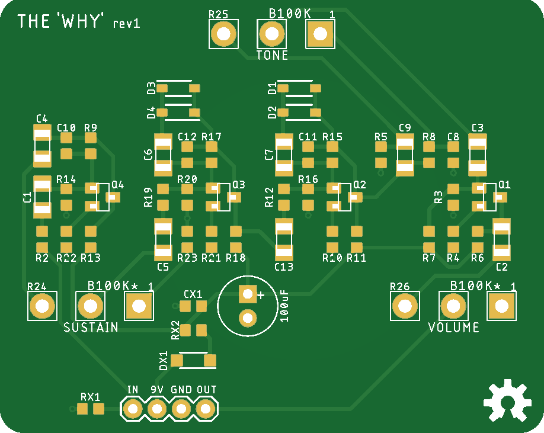

# The 'Why'

The 'Why' is an adaptation of the venerable Electro-Harmonix (EHX) Big Muff circuit. All components are surface mount (SMD) except for the power filtering capacitor and three board-mounted pots. So, assembly is as simple as soldering these four parts to the PCB.

## Big Muff Circuit Variation

The Big Muff is famous for its many different variants over the years, each having a unique sound due to its mix of component values, transistor types and current gain (hFE), and even the dielectrics of the capacitors. Since the topology of the schematic is consistent, the same PCB layout can be used to make (almost) any variant. So, fabricating a "Ram's Head" as opposed to a "Green Russian", for example, is a matter of editing the BOM. I have made no fewer than five great-sounding Big Muffs using the files in this directory, with some of them being mashups of values from several different variants (the [Cleveland Music Co. Smuffle Fuzz](https://clevelandmusicco.com/pedals/smuffle-fuzz/) is one such example).

The canonical source for Big Muff schematics has to be [Kit Rae's Big Muff Page](https://www.kitrae.net/music/music_big_muff.html). Here you can find a schematic for every known variant of the Big Muff circuit with consistent part identifiers and notes about capacitor dialectrics, transistors, etc.

To make it easy to fab different variants, I have used the same identifiers Kit uses on his website. The schematic in the `eagle` directory is from [the David Gilmour Big Muff](https://www.kitrae.net/music/David_Gilmour_Big_Muff.html) (which Kit calls "Version 2 Big Muff 1973 #3), and `BOM_gilmour.csv` specifies JLC part numbers that match this schematic. If you want to make a different variant, simply create a new BOM selecting parts that match the schematic you want to make.

`BOM_gilmour.csv` specifies fairly low-hFE [MMBT3904 transistors](https://jlcpcb.com/partdetail/21237-MMBT3904_RANGE_100_300/C20526). I think they sound great in this variant, but hFE on Big Muff transistors varies wildly. Do some reading at Kit's page and tweak as you see fit.

>[!NOTE]
> I'll probably add more BOMs in the future. Pull requests are also welcome! The only reason I haven't added more BOMs already is that most of mine use parts that aren't in the public JLC Parts Library ¯\\_(ツ)_/¯

You may occasionally need to change a capacitor footprint to use the part number you want (C8 is probably the leading candidate here; I happen to have a large number of C0G 0603 caps in my personal parts library). The largest footprint in `the-why.lbr` is 1206; there's plenty of space on the board to make all capacitors 1206 if you wanted to. You won't even need to change the CPL coordinates if you're careful.

## Through-hole Component Suggestions

| Qty | URL | Description | Notes |
| --- | --- | --- | --- |
| 3 | [Tayda SKU A-2907](https://www.taydaelectronics.com/b-100k-ohm-linear-taper-potentiometer-with-pc-mount.html) | B100K OHM Linear Taper Potentiometer PC Mount | I typically use A100K for SUSTAIN and VOLUME |
| 1 | [Mouser PN 667-EEU-FR1E101B](https://www.mouser.com/ProductDetail/667-EEU-FR1E101B) | Use whatever low-ESR cap you prefer |

## A Few Words About SMD/SMT Hate

Get over it. If you want to make an exact clone of a 1969 Big Muff Pi V1, best of luck to you; The 'Why' is probably not a project for you. The 'Why' _is_ for Muffheads who want to learn about SMT PCBA, are intrigued or at least aren't bothered by it, or just can't be arsed to source and solder through-hole components.

Sure, SMT is more difficult (if not impossible) to repair sometimes. And, yeah, such tiny parts must _sound different_ than big, magical, 'mojo' parts, right? Of course they do. But the same could be said for every part in every version of the Big Muff that ever used different capacitor dielectrics or resistor material or paint colour or whatever. An NP0 MLCC SMD capacitor performs differently than a polyester film cap. Obviously. But different isn't the same as inferior.

Also consider that component tolerances can make ten Big Muffs that came off the line back-to-back in 1974 all sound slightly different, even when brand new. Going by the values on a schematic will not get you an exact copy of the holy grail sound you might think you're seeking. Many of the critical components used were often well out of the specified tolerance in the first place, and as the parts age, those values drift even further.

(Let's not talk about 'fidelity', either. The purpose of distortion devices like the Big Muff is literally to _distort (pull or twist out of shape)_ an audio signal. Come on, man.)

So, if you know what you're doing and you select capacitor dielectrics that make sense, pay attention to transistor current gain, and so on, you can make a perfectly-legitimate, excellent-sounding (and often far less noisy) Big Muff with SMT.
